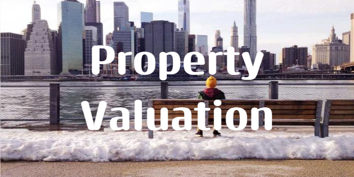

## PROPERTY VALUATION MODEL AND PROJECT 
***

### Introduction

***

California 1990 Dataset:  This data set shows the price or properties in California based on size(sqft), Average house income, proximity to the beach, bay and ocean, and city which is originally defined with (longitude and latitude).

### CSV DATASET :

  [PROPERTY_CSVFILE](https://www.kaggle.com/datasets/camnugent/california-housing-prices)

### Objective and Approach

***

This project will be in three phases because it aims to display various skills learnt during the NSCC Business Intelligence analytics program:

#### Phase 1 Predictive Analysis with pycaret: 

Pycaret will be used in predictive analysis where a continuous Value (Property Value) will be predicted based on dependent variables.

#### Phase 2 Data Wrangling with SSIS (SQL): 

Data Wrangling will be used in getting insight into data and creating valuable information and meaning into the dataset.

#### Visualization with (Power BI)

Power BI will be used in the data visuals, as this will create a better visualization and summary of the data set.

### Research Problem:

***

As we all know, most big cities are focused with Housing crisis, in most cases its either there is an insufficient supply of accommodation or there is an issue with overpriced or hike in rent.

The government and real estate company usually come under fire for not being able to provide enough accommodation to suit the high-, middle- and low-income earners, one of the economic classes always tends to be favored over the rest.

With respect to cities, This Project will be recommending what kind of property should be built to cater for low-, middle- and high-income earners.

### Research Question:

***

1.	What cities so the high income, Low income and middle-income earners reside in?
2.	What kind of properties (number of bedrooms) do high income, middle income, and low-income earners, rent or purchase with regards to the cities. (Cities vary).
3.	Which class has the lowest access to housing

### Future Exploration research questions:

1. Based on model, which is more profitable building houses for middle-, low- or high-income earners.

### Procedure/ Scope:

***

#### Predictive Analysis

1. Gather CSV files and data 
2. EDA exploratory data Analysis 
3. remove nulls and choose the exact data needed for data prep 
4. Start data prep and model pipeline 
5. Further explore data to find trends.

#### Data Wrangling:

1.	Convert Longitude and Latitude to actual cities.
2.	Converted Bedroom size to specific number of bedrooms.
3.	Converted income in usd to low-, middle- and High-income bracket.

#### Visualization:

1.	Dashboard 1 showing analysis of

- House Value by cites 
- House value by proximity to Ocean, Bay,etc 
- Average house value by No of bedrooms and Income bracket.

2.	Dashboard 2 showing analysis of 

- Average house value by City and Income bracket (Charts) 
- Average house value by City and Income bracket (Tree map)

3. Dashboard 3 showing analysis of 

- House value by proximity
- House value by Income range 
- House by income range, Cities and No of bedrooms (drill tru)

### FINDINGS:

***

 This project was able to discover the following trends to help answer the question:

Most High-income earners in San Francisco prefer to purchase since bed apartments for them sleeves while middle- and low-income earners tend to get bigger apartments because they share the apartment rather than live alone.

On the other hand, Middle- and low-income earners in outs etch cities like Clarke County CA/NV and CA/OR prefer to rent one or two bedrooms because living alone is affordable, However the high-income earners do not rent or get accommodations in those counties.

The low-income earners have the lowest access to hosing per sq ft.

### Validation:

 [FINDINGS_VALIDATION](https://www.rentcafe.com/cost-of-living-calculator/)

### Future exploration:

***

Create a model based on dataset (percentage property value increase by cities) : This classification model will predict if property value increase in cities for a given yean span and we can also check the percentage increase.  

With this model we can create a visualization on what cities we properties should be built and percentage projected increase in profit which should be expected.

#### Softare Versions:  
 

    Python version 3.10.9
    pycaret version 3.0
    Karnet enviroment pc310

#### PROJECT-STATUS : IN PROGRESS

#### JIRA AGILE METHODOLOGY :

  [JIRA-AGILE-WORKFLOW](https://juud.atlassian.net/jira/software/projects/CP/boards/2)

  ### Libraries used :

***

   

### VISUALIATION PROJECT AUTHOR: JUDE
***

